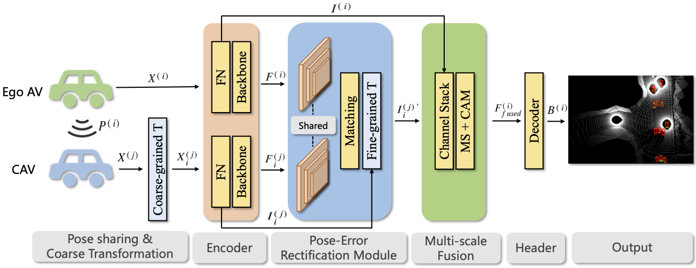

# FeaCo
The official implementation of ACM MM2023 paper "FeaCo: Reaching Robust Feature-Level Consensus in Noisy Pose Conditions".


> [**FeaCo: Reaching Robust Feature-Level Consensus in Noisy Pose Conditions**](https://doi.org/10.1145/3581783.3611880),            
> Jiaming Gu\*, Jingyu Zhang\*, Muyang Zhang, Weiliang Meng, Shibiao Xu, Jiguang Zhang, Xiaopeng Zhang <br>
> *Accepted by ACM MM 2023*

# Abstract
Collaborative perception offers a promising solution to overcome challenges such as occlusion and long-range data processing. However, limited sensor accuracy leads to noisy poses that misalign observations among vehicles. To address this problem, we propose the FeaCo, which achieves robust Feature-level Consensus among collaborating agents in noisy pose conditions without additional training. We design an efficient Pose-error Rectification Module (PRM) to align derived feature maps from different vehicles, reducing the adverse effect of noisy pose and bandwidth requirements. We also provide an effective multi-scale Cross-level Attention Module (CAM) to enhance information aggregation and interaction between various scales. Our FeaCo outperforms all other localization rectification methods, as validated on both the collaborative perception simulation dataset OPV2V and real-world dataset V2V4Real, reducing heading error and enhancing localization accuracy across various error levels.

# Note
The code will be released after the publication of the subsequent work.

## Citation
 If you are using our FeaCo for your research, please cite the following paper:
 ```bibtex
@inproceedings{gu2023feaco,
  title={FeaCo: Reaching Robust Feature-Level Consensus in Noisy Pose Conditions},
  author={Gu, Jiaming and Zhang, Jingyu and Zhang, Muyang and Meng, Weiliang and Xu, Shibiao and Zhang, Jiguang and Zhang, Xiaopeng},
  booktitle={Proceedings of the 31st ACM International Conference on Multimedia},
  pages={3628--3636},
  year={2023}
}
```

## Acknowledgment
FeaCo is built upon [OpenCOOD](https://github.com/DerrickXuNu/OpenCOOD) and [V2X-ViT](https://github.com/DerrickXuNu/v2x-vit). 
